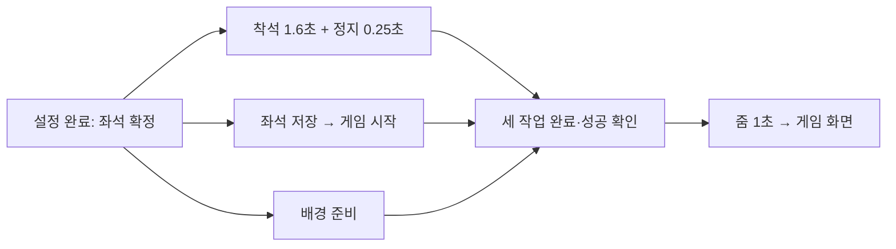

# 네트워크·화면 응답 지연 개선 — 개발팀 공유

작성일: 2026-10-10. 브랜치: `디벨럽1`. 기반 HEAD: `7bb2b1e`.
이 문서는 담당자가 바뀌어도 증상, 원인, 변경 이유, 검증과 남은 작업을 파악하기 위한 기록이다.
클라이언트 변경은 **로컬 구현 후보**다. 게임 준비 보고 후속 수정은 별도 검증 중이다. 2026-10-10 사용자 승인으로 서버
`createRealtimeRoom`만 배포했다. commit/push·개선 후 실측은 미완료다.

## 어떤 문제가 있었나

사용자는 iOS Simulator에서 로비 방 생성과 초기화에 체감 3~4초가 걸린다고 보고했다.
앱 전체를 조사하니 통신 외에도 요청 전에 끝까지 기다리는 연출, 성공 후 추가 정지,
독립 조회의 순차 실행, 동일 데이터 중복 요청이 있었다. 따라서 ‘Firebase 속도가 느리다’는
한 가지 원인으로 처리하면 서버를 개선해도 화면은 여전히 느릴 수 있다.

기존 debug 측정에서 초기화 1회는 7,418ms였다. 상태 조회 3,706ms와 close callable
3,598ms가 대부분이었다. 생성은 3,901ms/761ms에 실패했고 성공 생성 baseline은 없다.
이 값은 SDK·전송·함수 실행·DB 처리·응답을 포함하며 순수 ping이나 cold start 수치가 아니다.
측정 조건과 원문 해석은 [로비 계측 기록](../operations/ROOM_ACTION_LATENCY.md)을 따른다.

## 변경 전후

| 동작 | 이전 문제 | 이번 브랜치의 처리 | 기대 효과와 한계 |
| --- | --- | --- | --- |
| 최초 방 생성 | 생성 응답 뒤 곧바로 resume 추가 호출 | fresh requested + connectionSeq=1일 때 초기 접속 사용. identity 저장·presence·onDisconnect 유지 | 정상 최초 생성의 callable 1회 감소. 미확정 결과/실제 재접속은 resume 유지 |
| 방 초기화 | 새 close도 처리 결과부터 조회 | 새 intent는 바로 close, awaitingResult는 status 조회 | 정상 최초 초기화의 callable 1회 감소 |
| 초기화 후 재생성 | 종료된 방의 created slot을 다시 사용할 때 creationPending 실패 | 이전 종료 방의 instance/generation/creationOperationId가 일치할 때만 slot 교체 | create→close→create 회귀 해결. 보존 기간 단축 없음 |
| 방·네 게임 퇴장 | 최초 leave에도 status 조회 후 leave 호출 | 요청 전 durable 저장, 새 requested는 바로 leave, 미확정 요청만 status 확인 | 정상 최초 퇴장 callable 1회 감소. 결과 유실 때 같은 ID 사용 |
| 참가·프로필 갱신의 join 준비 | roomInstanceId 다음 내 player를 읽음 | 두 독립 조회를 병행한 뒤 결과를 조합 | RTDB 두 읽기를 한 번의 동시 대기로 처리. 서버 CAS 검증 유지 |
| 개인 게임 목록 | games 목록 조회 후 users 보유 목록 조회 | 두 조회 병행, 계정 변경 시 결과 폐기 | 대기 합을 병행 구간으로 축소 |
| 그룹 게임 목록 | entitlement callable 완료 후 games 조회 | 서버 권한 조회와 catalog 조회 병행 | 권한 판정은 기존 서버가 계속 수행. stale 그룹은 거절 |
| 중복 목록 로딩 | 같은 provider의 중복 fetch가 겹칠 수 있음 | provider의 진행 중 Future 공유, 같은 service의 진행 중 catalog read 공유 | 완료 후 새 refresh 가능. 장기 보유 권한 캐시는 추가하지 않음 |
| 자리 배치 완료 | 착석1.6초+hold0.25초 뒤 서버 준비, 그 뒤 줌1초 | 서버 준비·배경 준비·착석을 병행하고 모두 성공한 뒤 줌 | 기존 연출 유지하면서 앞선1.85초를 서버 대기와 겹침 |
| Final Call 교체/버리기 | 460ms 카드 연출을 끝낸 뒤 명령 전송 | 유효 입력 즉시 명령 시작, 연출과 응답을 함께 기다림 | 요청 전460ms 제거. 연출 자체는460ms 유지, 마감/중복 입력 보호 유지 |
| 방 코드 확인 성공 | check380ms 뒤 추가300ms 대기 | check380ms만 유지 | 기본 모션에서 고정300ms 단축. reduced motion은 기존처럼0 |
| 프로필 저장 성공 | check380ms 뒤 추가420ms 대기 | check380ms만 유지 | 기본 모션에서 고정420ms 단축. 실제 저장 전 성공 표시하지 않음 |
| Holdem 다운로드 | 파일을 한 개씩 받아 SHA-256 검사 | 최대3개씩 병행. 배치 전체 종료 뒤 다음 배치 | 여러 파일의 RTT/전송 대기를 겹침. 속도3배 보장 아님 |

첫 세 항목과 로비 오류 표시·단계 계측은 앞선 로비 개선 후보에 포함되어 있었다.
그 이후 항목은 앱 전체 조사 후 이번 구현에서 추가했다. 기존 디자인 export 및 다른
사용자 변경은 보존했다.

## 기다리는 순서를 어떻게 바꿨나

자리 배치 완료의 변경 전 임계 경로:

변경 후:

배경 준비를 제외한 설명용 식은 이전 `1.85초 + 서버 준비 + 1초`에서
`max(1.85초, 서버 준비) + 1초`다. 실제 절감량은 서버 준비 길이에 따라 달라진다.
실패 시 연출을 되돌리고 게임 화면으로 넘기지 않는다. 화면이 폐기되면 ticker 취소를
처리해 늦은 성공으로 화면을 이동시키지 않는다. 서버 게임 준비 barrier는 그대로다.

Final Call도 이전 `460ms + 명령 처리`에서 `max(460ms, 명령 처리)`가 된다.
UI는 결과를 미리 확정하지 않으며, 빠른 응답도 카드 연출을 중간에 종료시키지 않는다.

## 안전성 때문에 유지한 것

1. 서버가 roomInstanceId, membershipId, connectionSeq, game/phase/turn을 검증한다.
   입장 준비의 병행 조회는 원자적 snapshot이 아니므로 최종 join transaction이 권위다.
2. leave/close intent와 원래 요청은 **전송 전에** 저장한다. 상태가 awaitingResult이면
   operation status를 조회하고 applied/stale 확인 후에만 로컬 identity를 정리한다.
3. 목록 조회는 이미 진행 중인 작업만 공유한다. 장기 권한 캐시·다른 사용자의 프로필 읽기·
   서버 entitlement 우회는 없다. 응답 시 UID가 바뀌었다면 반환하지 않는다.
4. 다운로드 파일은 `.part`에 쓴 뒤 길이/SHA-256을 확인하고 rename한다. 모든 파일이
   성공하기 전에는 `.complete`를 쓰지 않는다. 하나가 실패해도 같은 배치의 나머지 writer가
   끝날 때까지 기다려 다음 재시도가 이전 writer와 경쟁하지 않게 한다.
5. 바뀌지 않은 경계: callable 이름/요청·응답 shape, DB schema, rules, 리전, dependency,
   heartbeat 주기, retry budget, 턴 규칙, 준비 보고. public API를 추가하지 않았다.

## 코드·리뷰 위치

| 관심사 | 구현 | 확인할 테스트 |
| --- | --- | --- |
| 생성/초기화/퇴장/참가 | [room_service.dart](../../lib/platform/home/room/services/room_service.dart) | [room_action_fast_path_test.dart](../../test/room_action_fast_path_test.dart), [room_join_recovery_test.dart](../../test/room_join_recovery_test.dart) |
| 목록 조회 | [game_list_service.dart](../../lib/platform/home/gamelist/service/game_list_service.dart), [provider](../../lib/platform/home/gamelist/provider/game_list_provider.dart) | [game_list_latency_test.dart](../../test/game_list_latency_test.dart) |
| 자리 배치 | [player_layout_editor.dart](../../packages/game_kit/lib/player_layouts/widgets/player_layout_editor.dart) | [table_background_transition_test.dart](../../test/table_background_transition_test.dart) |
| Final Call | [board_state.dart](../../packages/game_final_call/lib/phone/src/board_state.dart) | [final_call_action_latency_test.dart](../../test/final_call_action_latency_test.dart) |
| 다운로드 | [game_asset_cache.dart](../../packages/game_kit/lib/core/assets/game_asset_cache.dart) | [병행 설치](../../test/game_asset_parallel_install_test.dart), [설치 준비](../../test/game_asset_prepare_test.dart), [손상 검증](../../test/local_game_assets_test.dart) |
| 성공 후 추가 정지 | [phone_room_join.dart](../../lib/platform/home/phone/screens/phone_room_join.dart), [tablet_profile_modal.dart](../../lib/platform/profile/widgets/tablet_profile_modal.dart) | [기존 GUI 회귀](../../test/store_profile_gui_test.dart)와 기기 UX 확인 |
| 재생성 slot/계측 | [create-room.ts](../../functions/src/room/create-room.ts), [server timer](../../functions/src/room/room-action-timing.ts) | [allocation 회귀](../../functions/test/room-allocation-sdk-cache.test.mjs), [timing 회귀](../../functions/test/room-action-timing.test.mjs) |

## 검증 현황

| 검사 | 결과 | exit |
| --- | --- | --- |
| Flutter 직접 관련 검사: room fast path, catalog, parallel assets, layout, join recovery, profile GUI, asset preparation/local integrity | PASS 53개 | 0 |
| 추가 join 병행 + Final Call 즉시 전송/중복 차단/성공·실패 회귀 | PASS 8개 | 0 |
| Node22 PATH `dart run :mosigame test session --json` | PASS, Flutter156·Functions97, working-tree mutation 없음 | 0 |
| Node22 PATH `dart run :mosigame test auth --json` | PASS, Flutter34·Functions12, working-tree mutation 없음 | 0 |
| `flutter analyze --no-pub` (동일 소스 영문 경로 사본) | PASS, 문제 없음. 최초5건은 불필요 import 및 테스트 전용 SDK Fake 경고였으며 정리 후 통과 | 0 |
| 이번 후보 `dart run :mosigame validate --full --json` (Node22 PATH, 동일 소스 영문 경로 사본) | 사용자 승인 후 1회 PASS, 12단계·99초. root393·game_kit100·LP12·FC14·Mafia55·Holdem31·Functions397 | 0 |
| 개선 후 실제 Firebase/Simulator·실기기 시간 | 미측정 | — |

`git diff --check`와 문서 상대 링크 검사는 PASS다. 기존 파일 삭제 없음, 디자인 export와
이번 범위 밖 파일의 시작 해시를 보존했다. 최종 후보는 미커밋 상태이며 staged 변경이 없다.

53개와8개는 일부 기존 테스트가 겹치므로 고유 테스트 총수로 합산하지 않는다.
session/auth 검증 후 추가된 테스트는 별도8개 검사와 이번 FULL에서 실행했다. 이번 FULL은
이전 로비 후보와 별도로 승인·실행했다. 1,485개 파일 및 Git 상태의 사본 일치를 실행 전에
확인했고, 사본의 working-tree mutation 검사와 원본 실행 전후 해시 모두 변경 없음이다.
포맷·전체 분석·패키지5개 검사·Functions lint도 PASS다. 이후 결과 문서만 갱신했다.
로그와 작업 시작 snapshot은
ignored `build/app-latency-improvement/`에 보관한다.

## 아직 해결했다고 말할 수 없는 부분

전체 [50개 조사 후보](../operations/APP_LATENCY_AUDIT.md)를 한꺼번에 바꾸지 않았다.
다음은 효과 측정 또는 구조/제품 결정이 먼저 필요하다.

- **서버 room 전체 transaction과 명령 이력 증가:** 긴 게임에서 room 크기/재시도 횟수를
  측정한다. ledger를 TTL로 삭제하면 늦게 재전송된 명령이 다시 실행될 수 있다.
- **cleanup trigger:** room 하위 변경마다 실행되는 작업의 실제 부하를 측정하고,
  generation·deadline 일관성을 지키는 생략 조건부터 설계한다.
- **서울 Functions/싱가포르 RTDB, cold start:** 동일 조건 cold/warm 및 서버 단계 계측 후
  비교한다. 리전 이전/minInstances는 운영·비용 판단 없이 적용하지 않았다.
- **앱 부트스트랩·렌더링·소리:** 첫 프레임, native 초기화, 이미지 decode, rebuild를
  실기기 profile로 측정해 순서를 정한다.
- **긴 게임 연출/빠른 진행 옵션:** Holdem 결과12초, Mafia 발표 등은 게임 경험과
  여러 기기의 진행 동기화에 영향을 주므로 별도 결정한다.
- **catalog 장기 캐시/에셋 검증 캐시:** 최신 권한·설치 손상 invalidation부터 설계한다.

## 배포·측정 담당자 인계

이번 추가 변경은 클라이언트 배포 대상이다. 2026-10-10 사용자가 앱만 재실행하고 서버를
배포하지 않았음을 확인한 뒤, 재생성 오류 수정이 포함된 `createRealtimeRoom`만 배포했다.
대상은 `project0000-ec01e` / `asia-northeast3` / Node22이며 CLI 업데이트 성공·exit0을
확인했다. 검증한 Functions 파일154개와 배포 소스가 일치했고 predeploy lint/build도 통과했다.
`closeRoom`, `game_common_operation_status`의 추가 timing은 이번 배포에 포함하지 않았다.
앱 재설치 없이 서버 수정은 적용되지만, 실제 방 생성·초기화·재생성 결과와 속도는 재확인이
필요하다. 정제한 배포 기록은 ignored `build/room-create-deploy/result.json`에 보관한다.
후속 배포도 승인된 범위에서 [Cloud Functions 절차](CLOUD_FUNCTIONS.md)를 따른다.

동일 조건에서 다음을 기록한다.

- 입력부터 요청 전송, 응답, RTDB 상태 반영, 첫 완료 프레임, 다음 입력 가능 시점을 분리.
- 최초/반복, 정상/실패, 참가자 수, 캐시 유무, 기기/빌드/Wi-Fi를 구분.
- fresh leave는 status 호출이0회, 미확정 leave는 같은 operationId로 status 확인인지 점검.
- 자리 배치의 빠른 응답/느린 응답/서버 실패/roster 변경/화면 종료를 모두 확인.
- Final Call 마감 직전 입력/빠른 상태 수신/실패/중복 클릭에서 이중 명령과 카드 잔상이 없는지 확인.
- Holdem 첫 설치/동시 설치/다운로드 실패/부분 재시도/손상 파일을 확인.

1초대 로비 응답은 목표 후보이며 이번 로컬 테스트 통과만으로 달성을 주장하지 않는다.
문서 담당자는 실제 측정값이 생기면 이 표에 조건과 성공·실패 여부를 함께 추가한다.

## 2026-10-10 게임 진입 정지 조사

사용자는 이틀 전에는 게임이 됐지만 지금은 태블릿·휴대폰에 요소가 나타나지 않고
휴대폰에 “화면 준비를 확인하지 못했어요”가 표시된다고 보고했다. 로컬 시뮬레이터의
18:41 KST 로그에서 Liar's Poker 시작 요청과 dealing 정지를 확인했다. 운영 DB나
Cloud Functions 실행 로그를 조회하거나 새 게임 요청을 보내지는 않았다.

### 확인한 실제 흐름

| 기기 | 에셋/화면 준비 | 준비 보고 결과 |
| --- | --- | --- |
| iPad Air 11-inch M4 | 화면 준비390ms | accepted, 진입 계측 시작부터6310ms |
| iPhone 17e | 화면 준비1233ms | accepted, 진입 계측 시작부터7735ms |
| iPhone 17 Pro | 화면 준비1196ms | 18:41:06.344 ready 시작 후 18:41:10.121 실패 처리. 실제 report 전송·accepted 로그 없음 |

세 기기 모두 공개 상태의 `phase=dealing`, `status=playing`을 수신했고 ready 시작 때
`localUsable=true`, `paused=true`였다. 따라서 이 사례는 이미지 디코딩/첫 프레임 실패로
단정할 수 없다. 시작 callable도3105ms에 성공했다. 마지막 공개 기록은 revision4/dealing이다.
분배 전 개인 손패의 빈 snapshot은 LP 계약상 정상이며 이것만으로 데이터 손상을 뜻하지 않는다.

### 최근 변경과 관계

- **10월9일 `56cd535`**: 공용 네트워크 복구 구현. 새 게임을 `beginRecoveryPause`로
  시작하고 진행 태블릿과 살아 있는 참가자의 유효한 ready가 모두 있어야 재개한다.
  `functions/src/game-interruption/game-mutation.ts`, `recovery-state.ts`가 해당 경로다.
  이전에는 이 공용 준비 확인이 없었다. 현재는 한 기기의 준비 보고 실패가 전체 진행을 막는다.
- **같은 커밋의 클라이언트 결함**: `GameInterruptionCommandService.report`는
  `RoomRecoveryBatch`에서 공용 `invoke`를 실행한다. 별도 `GameCommandBatch`가 없을 때
  `owner`와 `_unresolved`는 같은 Map이다. `owner.putIfAbsent`로 새 요청을 넣은 뒤
  `_unresolved.containsKey`를 검사하므로 최초 전송도 재전송으로 분류한다.
  결과적으로 `game_common_operation_status`를 먼저 호출한다.
- **10월10일 `5d7b5d5`**: ready 응답 승인·접속 검증을 보강하고 실패를 같은
  “화면 준비” 문구로 표시한다. 사전 결과 조회는 `invoke`의 요청 시작/오류 기록 블록
  밖에 있고 `_report` catch도 오류 종류를 기록하지 않아 실제 원인이 메시지에 가려진다.
- GUI 쪽은 정상 준비 중 배경을 유지하고 LP 휴대폰은 손패 진입 조건을 기다린다.
  분배 단계에서 멈추면 사용자는 빈 배경 또는 진행 없는 화면으로 보게 된다.
  직전 배포는 `createRealtimeRoom` 하나이며 위 게임 준비 코드의 배포가 아니었다.

### 로컬 재현으로 확정한 결함과 한계

기존 실제 서비스 테스트의 Firebase callable 대역을 사용해 ignored
`build/game-start-investigation/fresh_ready_probe_test.dart`에 조사용 재현2개를 만들었다.
제품 소스나 정식 테스트는 변경하지 않았다.

1. 새 ready의 호출 순서가 `operation_status → recovery_report`임을 확인했다.
2. status 조회에 합성 `internal` 오류를 주면 report는0회, 실패로 종료됨을 확인했다.

실행: `flutter test --no-pub build/game-start-investigation/fresh_ready_probe_test.dart
--plain-name 'investigation:' --reporter expanded`, 재현2개 PASS/exit0.
이 PASS는 결함 재현 성공이며 수정 완료가 아니다. 기존 ready 재전송 테스트는 최초
status 호출0회를 요구하지 않아 해당 결함을 검출하지 못한다.

실제 Pro 로그에도 ready 시작 후 report 전송 없이 실패하는 흐름이 있지만, **실제 사전
조회 오류 코드까지 확정하지 못했다**. 합성 internal을 실제 서버 오류라고 주장하지 않는다.
접속·인증/envelope 검증이나 결과 조회 응답 등 전송 전 실패를 추가로 구분해야 한다.
로컬 저장 기록에서는 같은 사용자·방의 controller/player 역할 충돌은 발견되지 않았다.

### 개선 순서

1. 미확정 기록을 추가하기 **전** 이전 전송 여부를 판정하고 최초 ready는 바로 전송한다.
   응답 유실 재시도에는 원래 commandId/reportSeq/domain의 결과 확인과 재생을 유지한다.
2. 요청 전 검증/결과 조회/실제 전송/ready 승인 단계를 구분해 식별자 없는 오류 코드와
   시간을 기록한다. 에셋·데이터 실패와 서버 준비 승인 실패를 같은 원인으로 안내하지 않는다.
3. 최초 ready status0회, 사전 조회 장애, 응답 유실 재전송, 접속 교체와 다기기 시작을
   검증한다. 기존 전체 ready 규칙을 제거하는 것은 제품/상태 계약 변경이므로 이 조사에서
   우회하지 않았다.

정제한 기기 기록: `build/game-start-investigation/ready-timeline.json`,
`simulator-diagnostics.json`, `local-error-types.json`, `local-identity-summary.json`.
제품 수정·추가 배포·새 FULL은 이 조사에서 수행하지 않았다.

## 2026-10-10 게임 준비 보고 수정 후보

위 조사에서 재현한 최초 ready 사전 조회 결함을 수정했다. 이는 앱의 공통 Dart 코드
수정이므로 서버 재배포가 아니라 태블릿·참가 휴대폰의 앱 반영이 필요하다.

### 변경 사항

- `GameCommandService.invoke`: 요청을 Map에 등록하기 전의 미확정 여부를 캡처한다.
  최초 ready/failed 보고는 바로 callable로 전송한다. 실제 응답 유실 재시도는 이전
  commandId/reportSeq/domain을 유지하고 결과 조회·원래 응답 재생을 거친다.
- 결과 조회 실패를 요청 전송 실패와 구분해 시간·허용된 오류 분류로 기록한다.
  callable 응답의 비공개 payload나 오류 원문은 기록하지 않는다.
- `GameSessionController`: 서버 ready 승인 실패는 “서버에서 게임 준비 완료를
  확인하지 못했어요. 다시 연결해주세요.”로 안내한다. 이미지/데이터/프레임 준비 실패의
  기존 문구와 구분하고, 늦은 데이터로 실패 안내가 사라지지 않게 유지한다.
- debug 진단은 `screen`, `local_data`, `ready_ack`, `ready_report`, `ready_response`,
  `failed_report`, `ready_reconnect` 단계와 제한된 오류 분류만 남긴다.
- 서버의 모든 필수 기기 ready 조건, 접속/게임 세대 검사, 재시도 횟수와 deadline,
  public API·persistent data는 유지한다. 네트워크가 실패했는데 준비 성공으로 우회하지 않는다.

### 검증 및 인계

`test/game_command_response_loss_test.dart`에 최초 ready/failed status0회, status endpoint
장애와 독립된 최초 전송, 응답 유실 후 조회 장애와 동일 요청 재생 회귀를 추가했다.
기존 응답 유실 테스트도 처음부터 report를 보내고 재시도 때만 status1회를 보내도록 강화했다.
`packages/game_kit/test/recovery/providers/game_readiness_contract_test.dart`는 서버 승인
오류와 화면 오류 문구 분리, 늦은 데이터 이후 오류 유지, 명시 재시도 후 입력 복구,
비공개 오류 원문 미기록을 확인한다.

직접 관련2파일34개 PASS/exit0. 최초 Project CLI session의 Flutter/Functions는 모두
통과했지만 실행 중 별도 Final Call 에셋15개 삭제와 설정/생성 코드 변경이 들어와
working-tree mutation 단계가 FAIL/exit1이었다. 외부 변경은 원복하지 않고 현재 내용의
고정 사본을 만들어 재검증했다. 사본 session은 Flutter161·Functions97 및 mutation 검사
모두 PASS/exit0다. 전체 Flutter 분석도 PASS/exit0(6.7초)다. 최초 실패를 제품 테스트
실패 또는 전체 PASS로 표현하지 않는다.

사용자 승인 후 동일 소스 영문 경로 사본에서 Node22 PATH로
`dart run :mosigame validate --full --json`을 1회 실행했다. **PASS/exit0, 118.156초,
12단계**다. root396·game_kit101·LP12·FC14·Mafia55·Holdem31·Functions397,
총1,006개 테스트와 format/analyze/lint/mutation이 통과했다. 원본1470개 파일 해시와
Git 상태도 실행 전후 일치했다. 아래 결과 기록 문서만 검증 이후 갱신했다.

빌드 결과: 사본의 첫 iOS 빌드는 generated Swift plugin package 누락으로 실패했다.
기존 생성 파일이 있는 원본에서 `flutter build ios --simulator --debug --no-pub`을 실행해
PASS/exit0(Xcode43.9초), `build/ios/iphonesimulator/Runner.app`을 생성했다.
빌드 전후 소스1470개 해시와 staged 없음 상태를 보존했다.

### 승인된 기존 방 재시험 결과 — 전체 게임 복구는 미완료

19:05 KST 수정 앱을 iPad Air·iPhone 17 Pro·iPhone 17e에 설치하고 재실행했다.
각 설치/실행 exit0. 태블릿은 자동으로 기존 LP 게임에 복귀했고 휴대폰은 각각
‘게임 다시 참여’를 한 번 눌렀다. 방 생성·초기화·강제 종료·추가 서버 배포는 하지 않았다.

- iPad: 공개 상태 revision5/dealing 수신, assets380ms/screen387ms.
  19:05:51.931 ready 시작 → 51.932 실제 전송 → 52.501 accepted.
  callable568ms, 준비 측정 ready957ms. 최초 ready가 사전 status 왕복 없이 즉시
  전송되는 동작을 실환경에서 확인했다. 이전 iPad ready6310ms와는 신규 시작/재접속,
  warm 상태 등 조건이 다르므로 이를 일반적인 속도 개선율로 환산하지 않는다.
- iPad 화면: 배경만 남던 상태에서 ‘게임을 잠시 멈췄어요 / 연결과 화면 준비를
  기다리고 있어요’와 ‘카드 분배 시작’ 요소가 나타났다. 마지막 공개 상태는
  revision6/dealing/playing이며 전체 필수 기기 준비가 충족되었다는 증거는 없다.
- 두 휴대폰: 기존 게임 재참여 안내는 표시됐지만 각각 한 번 누른 후 버튼만 다시
  활성화되고 게임 화면으로 복귀하지 않았다. 진단에는 RTDB 연결만 있고 ready
  전송 기록이 없다. **준비 보고 수정의 휴대폰 검증 이전에 재참여 경로가 막혔다.**
- 현재 `PhoneHome._acceptReturn`은 예외를 삼키고 restore=false이면 안내 없이
  반환한다. `RoomProvider.restorePlayerRoom`의 일부 오류는 errorMessage에만
  저장되며 복귀 화면에 보이지 않는다. 이 진단 공백은 코드로 확인했다. 어떤
  서버/로컬 오류가 실제 발생했는지는 이번 로그로 확정하지 못했다.
- 로컬 Dart 디버그 상태 조회도 결과를 얻지 못했다. 이를 제품 오류 원인의 증거로
  사용하지 않는다. 원래 18:41 Pro ready 사전 단계 오류 코드 역시 미확정이다.

**카드 분배·첫 턴 진행은 확인하지 못했으며 해결 완료가 아니다.** 재시험의 기기별1회
범위를 소진했으므로 추가 재참여나 방 초기화로 상태를 변경하지 않았다. 다음 작업은
휴대폰 복귀 경로의 단계/허용 오류 코드와 사용자 오류 안내를 보강하고, 보존된 기존
방에서 추가 재시험하여 원인을 좁히는 것이다. 준비 조건을 무시하거나 모든 기기
ready 규칙을 제거하지 않는다. 새 최종 소스 후보의 FULL은 별도 승인 대상이다.

증거: ignored `build/game-ready-fix/full.json`, `full.log`, `device-install.json`,
`device-launch.json`, `device-logs.json`, `local-error-summary.json`.

최종 상태 점검: FULL 종료 후 별도 Final Call 에셋·소스, 공용 카드 연출/룰북,
태블릿 미리보기, GUI 테스트 및 파일 참조 문서 변경이 추가로 관찰됐다. 이 작업은
해당 변경을 만들거나 되돌리지 않았으며 보존했다. **FULL PASS는 승인 시점의 고정
사본에만 적용되며 이후 외부 변경까지 포함한 현재 전체 working tree의 PASS가 아니다.**
차이 목록은 `build/game-ready-fix/final-state.json`에 기록했다. branch 디벨럽1,
HEAD `7bb2b1e249c8305ad62458b001bff5057e02e5fd`, staged0, packages.zip/design_exports 보존.
